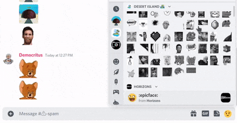

# Not Quite Nitro

Chrome extension to use Discord Emoji without Nitro

## Installation Instructions Chrome / Microsoft Edge / Brave / Opera

- Download this repo as a ZIP file from GitHub.
- Unzip the file.
- In Chrome/Edge go to the extensions page (chrome://extensions or brave://extensions or opera://extensions).
- Enable Developer Mode.
- Drag the extracted folder anywhere on the page to import it (do not delete the folder afterwards).

  
## How to use

#### Click on any emoji (in emoji panel or in chat)

It will get copied to the clipboard

## FAQ

#### Does this steal my TOKEN?

Simply, No
This extension doesn't use your token or doesn't even connect to the internet
(Feel free to look at the code)

#### How does it work?

This extension only modify already loaded website

#### Will my Discord account get banned?

Hm , I dont think so. Technically this extesnsion does not communicate with discord servers. So there's no direct way for people at discord to know if you use this or not

## Important Messages

- This is still under development, so be sure to check this repository frequently
## 🔗 Links
Join my discord server for the latest updates

## Known Bugs

We Fixed all previous bugs !!!

## Known Issues

- I alredy know Its somewhat not what you expected
- dont worry I'll try my best to make it better

  
